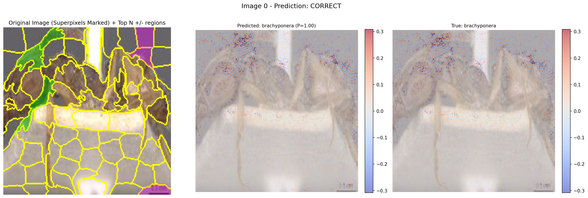

# Ant Genus Identification and Learning Platform

An interactive web application that combines computer vision and language models to help students identify ant genus and explore myrmecology.

## Features

* **Ant Genus Identification**: Upload an ant image to predict its genus using a trained EfficientNet-B4 CNN model.
* **AI Chatbot (AntTutor)**: Ask questions and receive detailed, natural language answers about ant biology and behavior.
* **Species Mapping**: (Optional) Plot sightings on a map (ArcGIS support available).
* **Interactive Quizzes**: Learn more about ants through built-in educational quizzes.

## Requirements

* Python 3.8+
* PyTorch
* Flask
* torchvision (with `efficientnet_b4` weights) 
* An LLM provider:

  * **Ollama** (default): Must be installed locally. [Download Ollama](https://ollama.com/)

    * Required model: `llama3.2`

      ```bash
      ollama run llama3.2
      ```
  * **OpenAI**: Requires an OpenAI API key

## Setup

1. Clone this repository:

   ```bash
   git clone https://github.com/tstilwell91/cs895_project_ants.git
   cd cs895_project_ants
   ```

2. Install dependencies:

   ```bash
   pip install -r requirements.txt
   ```

3. Create a `.env` file in the root directory and configure your API keys and LLM provider:

   ```bash
   # LLM Provider: choose "ollama" (default) or "openai"
   LLM_PROVIDER=ollama

   # Required only if using OpenAI
   OPENAI_API_KEY=your_openai_api_key

   # Optional: For map features
   ARCGIS_API_KEY=your_arcgis_api_key
   ```

4. Copy the local model files from `models/genus/` to `models/`:

   ```bash
   cp models/genus/* models/
   ```

5. Start the app:

   ```bash
   python app.py
   ```

6. Open [http://localhost:5002](http://localhost:5002) in your browser.

## Project Structure

* `/static`: CSS, JS, and logo assets
* `/templates`: HTML UI (Flask Jinja templates)
* `/models`: Trained CNN weights, class list, and genus metadata
* `/uploads`: Temporary storage for uploaded user images

## Model Files

You can use the genus classification model in one of two ways:

1. **Local model files**: Copy the contents of the `models/genus/` folder into the `models/` directory:

   * `genus_best_model_full.pth`: Trained EfficientNet-B4 model
   * `classes.json`: List of genus labels (lowercase)
   * `genus_metadata.json`: Descriptions, habitats, and facts per genus

2. **Hugging Face model repository**:
   The same model is also hosted at [huggingface.co/tstilwel/antID-tutor-genus](https://huggingface.co/tstilwel/antID-tutor-genus) for easy access or integration into external pipelines.

   Example code to load model from Hugging Face:

   ```python
   from huggingface_hub import hf_hub_download
   import torch

   # Download model file from repo
   model_path = hf_hub_download(repo_id="tstilwel/antID-tutor-genus", filename="genus_best_model_full.pth")

   # Load the model
   model = torch.load(model_path, map_location="cpu")
   model.eval()
   ```

## Testing Inference Locally

To test the trained CNN model on a local system outside the web application, you can run the standalone inference script:

### Steps

1. Navigate to the `inference/genus/` folder:

   ```bash
   cd inference/genus
   ```

2. (Optional) If using a GPU node or container environment on the ODU Wahab cluster, allocate a GPU:

   ```bash
   salloc -p gpu --gres gpu:1
   module load container_env pytorch-gpu/2.5.1
   ```

3. Run the inference script. The model can be found in the `models/genus/` folder or downloaded from Hugging Face:

   ```bash
   crun -p ~/envs/myrmecid python inference.py \
     --image casent0901862_h_1_med.jpg \
     --model genus_best_model_full.pth \
     --classes classes.json
   ```

### Expected Output

The script will:

* Load the CNN model
* Preprocess the image
* Output the predicted ant genus and confidence score

Example:

```
Using device: cuda
Detected 42 classes.
Loading model from: genus_best_model_full.pth
Preprocessing image: casent0901862_h_1_med.jpg
Predicted genus: polyrhachis (confidence: 1.0000)
```

Note: You may see a `FutureWarning` from PyTorch regarding `torch.load`. This is expected and safe when using your own model checkpoints.

## Model Explainability

To better understand the model's predictions, especially which parts of the ant images most influence the classification decision, we provide a script using SHAP (SHapley Additive exPlanations) with optional **superpixel segmentation**.

### Folder Structure

The explainability scripts are organized under:

```bash
explainability/
├── explain_shap_super.py        # Main SHAP explanation script with superpixel support
├── explain_shap_super.sh        # SLURM submission script
├── exp1_compare_image_0.png     # Example SHAP explanation image
```

### Requirements

Ensure you have the following additional dependencies installed:

```bash
pip install scikit-image shap
```

### Running the Script

To generate SHAP explanations on the Wahab cluster:

```bash
cd explainability

sbatch explain_shap_super.sh
```

### Parameters:

* `--model_path`: Path to the trained model `.pth` file.
* `--data_dir`: Root directory containing subfolders of genus-labeled ant images.
* `--output_file`: Base name for output SHAP plots.
* `--num_explain`: Number of images to explain.
* `--num_background`: Number of images to use for SHAP background distribution.
* `--analysis_mode`: Choose between `predict_only` and `compare_pred_true` modes.
* `--add_superpixel_stats`: Enable superpixel-based SHAP region analysis.
* `--num_superpixels`: Approximate number of superpixels to generate per image.
* `--top_n_superpixels`: Number of positive/negative contributing regions to highlight.

### Output:

* Images are saved to the current directory (or use full path in `--output_file`).
* When `--add_superpixel_stats` is enabled, the original image will include overlays of superpixel boundaries and the most influential regions (positive and negative).

### Sample Output



```
Using device: cuda
Selected Analysis Mode: compare_pred_true
Superpixel stats enabled.
Loading dataset structure from: ../training_data
Dataset: Found 10211 images across 42 genera.
Found 42 classes (10211 images total).
Defining model architecture (EfficientNet-B4) for 42 classes...
Loading trained model weights from: ./genus_best_model.pth
Using batch size 8 for SHAP data.
Loading background data batches...
Loading explanation data batches...
Using 50 background images.
Explaining 5 foreground images.
Calculating SHAP values (this may take some time)...
SHAP finished in 226.25 sec.
DEBUG: Type of shap_values_np: <class 'numpy.ndarray'>
DEBUG: SHAP values shape: (5, 3, 224, 224, 42)
DEBUG: SHAP stats: min=-2.81, max=2.58, mean=5.7e-06
DEBUG: Plotting SHAP shape: (5, 224, 224, 3, 42)

--- Starting Explanation Loop for 5 Images ---
--- Processing Image 1/5 ---
  Calculating Superpixel Stats (Predicted Class: brachyponera)...
    Generated 70 superpixels in 0.08 sec.
    Top 3 Negative Superpixels (RegionID: MeanSHAP):
      69: -0.0009
      15: -0.0009
      9: -0.0008
    Top 3 Positive Superpixels (RegionID: MeanSHAP):
      3: 0.0061
      13: 0.0033
      27: 0.0030
  Generating 'compare_pred_true' plot for image 0...
  Saving plot to ./shap_output/exp1_compare_image_0.png...
  Plot saved.
```

### Interpreting Model and Superpixel Highlights

The SHAP image plots in `compare_pred_true` mode include superpixel highlights:

* The **green highlighted areas** (top positive superpixels) appear mainly on the legs and the petiole/waist region. This tells you that the model found the strongest evidence for *bothroponera* in these specific parts of the ant for this image.
* The **purple (magenta) highlighted areas** (top negative superpixels) are on the upper part of the mesosoma (thorax) and perhaps some lower background/leg areas. These regions contributed negatively (or least positively) toward the *bothroponera* prediction.

Regardless of the mode, the second panel displays the predicted class along with its confidence score, while the third panel shows the true class label. Each image is overlaid with SHAP values. Red regions indicate areas that contributed positively toward the class decision, and blue regions indicate areas that contributed little or negatively.
